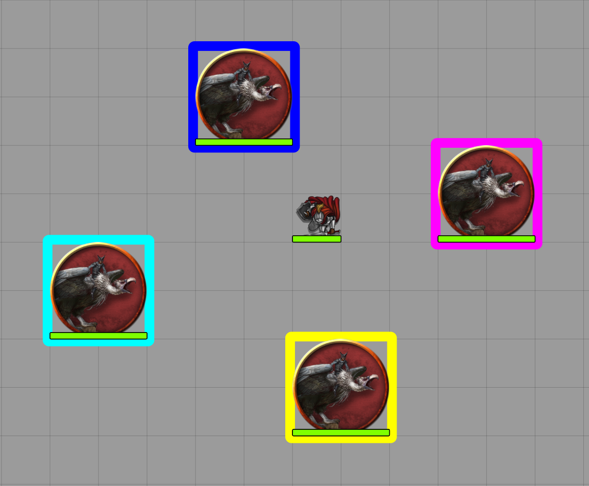
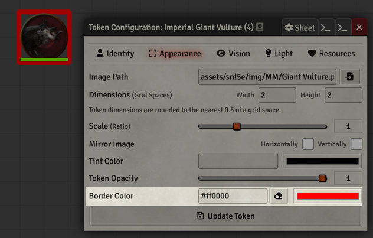

# Rainbow Room
A [FoundryVTT](https://foundryvtt.com/) module to provide colored icon borders to ease identification of tokens. Great for in-person play!


## Just Give it to Me

Add-on Modules -> Install Module -> Manifest URL -> 
```
https://github.com/jshank/fvtt-rainbowroom/releases/latest/download/module.json
```

## What is this for?
Make it easier for your players to identify tokens during in-person play.

> Player - "I want to shoot my shortbow at the vulture"
>
> GM - "Which one?"
>
> Player - "The blue one!"




## Main Interface
Two buttons are added to the Token toolbar that allow the GM to set unique border colors for a group of tokens. Simply select the tokens you wish to add borders to and click on the **Bulk Color Token Borders** button. 

To clear borders, select all tokens you want to remove the borders from and click on the **Clear Token Borders** button


## Individual Token Configuration
The module adds a **Border Color** field and color selection tool to the Token Appearance menu. You can either type in an RGB value in the format `#00FF00` or select the color and then select **Update Token**

To clear a border, simply click on the erase icon between the text field and color selector, and then select **Update Token**



## General Disclaimer
This is my first Foundry module and first attempt at developing anything in Javascript. The code likely reflects those conditions so don't be suprised if it blows up or misbehaves. If you have improvements, don't be shy, open a PR and I'll be quick to review and merge. 

## TODO
- [ ] A settings section would be nice to configure border thickness, offsets and configuration. For now, feel free to edit the Colorize function in rainbowroom.js to your liking.
- [ ] Support for non-square borders
- [ ] Break the monolithic js file into classes for easier maintenance

## Acknowledgements
 - [Foundry VTT Module Making for Beginners](https://hackmd.io/@akrigline/ByHFgUZ6u/%2FF4CFuxqZSTOcqgixEf9M6A) by Andrew Krigline, aka “Calego” was an invaluable start
 - The amazing folks on the [Foundry VTT module-development channel](https://discord.com/channels/170995199584108546/722559135371231352) are patient, knowledgable and kind. Special thanks to EBER#7243 and mxzf#5874.
 - Much of the drawing code is shamelessly copied from https://github.com/kandashi/Border-Control
 - I also copied some of the interface handling and button overrides from https://github.com/CDeenen/LockView
 - The awesome how-to videos for publishing on github by [spacemandev](https://www.youtube.com/user/Devenish97)
 - Of course, none of this would do anything without the amazing work of everyone who has built [FoundryVTT](https://foundryvtt.com/)